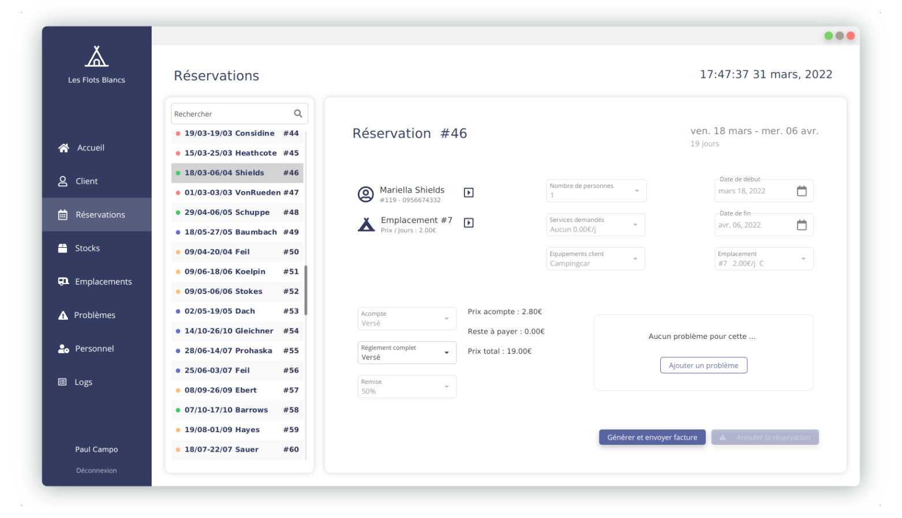

<h1 align="center">
Campsite Management App
</h1>

<h4 align="center">
  Desktop application made as a school project that aims to simplify the management of a campsite
</h4>

<h5 align="center">
  Clients - Billing - Logistic - Staff - Issues
</h5>

---

> The app is made with JavaFX and uses Mysql.

---

Authors :
- Ruben Moreno
- Emilien Gallon
- Gaël Barré-Beylot
- Hugo Martin
- Célian Riboulet