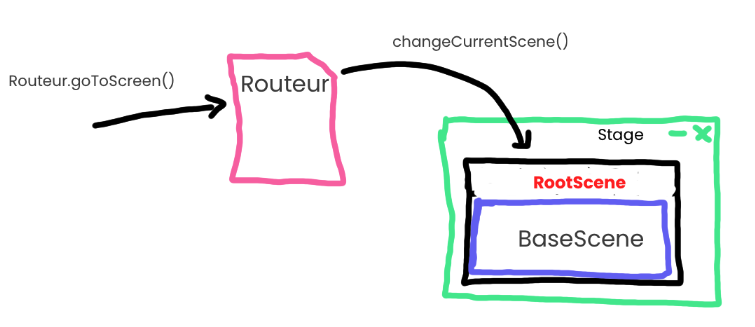
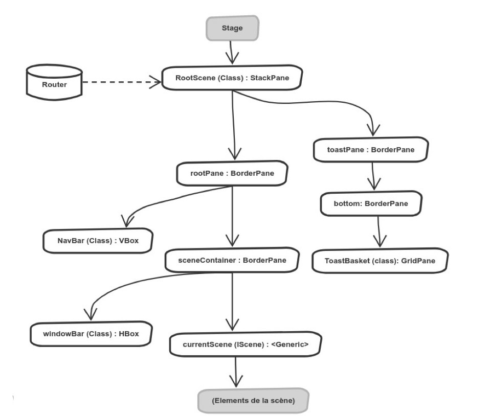
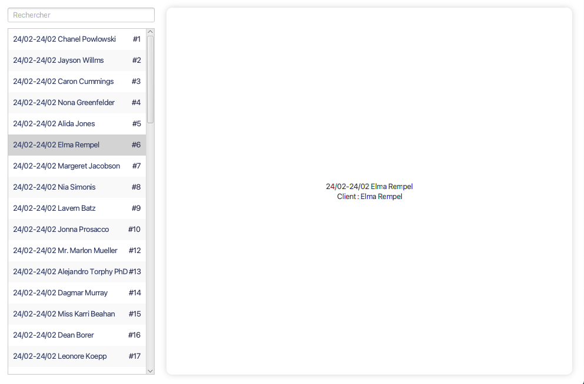

# Structure du projet

# 1 / Routage et hiérarchie JavaFX

## Élèments :



- Le **Routeur** est une classe statique (Pas d'instance, toutes les méthodes sont `static`) permettant de changer la page (ou scène actuellement affichée à l'écran).

- Un **Stage** JavaFX est tout simplement la fenêtre de l'application, soit ce qui contient les boutons réduire / plein écran / fermer et la racine de la hiérarchie (RootScene)

- La classe **RootScene** est une scène javaFX contenant
  
  - La Barre de navigation
  
  - La page courante (Scène JFX) qui est du type **IScene** (Interface)
  
  - **RootScene n'est jamais déchargée** (Il y a une unique instance dans le projet)

- Les classe de type **IScene** sont des pages de l'application, ces dernières sont chargées / déchargées par RootScene.
  
  - Une page doit est donc une classe java implémentant l'interface IScene et avec un extends sur un composant JavaFX (Le plus adapté pour la page)

  - ```java
    public class LoginScene extends VBox implements IScene
    ```
    
    - ici LoginScene contiendra ensuite ses éléments : boutons, labels, etc...

## Changer de page :

Pour changer de page, il faut changer l'instance de BaseScene actuellement affichée par RootScene.

Pour cela : 

```java
Router.goToScreen(Routes.HOME);
```

1. `Router.goToScreen(...)` -> dis à la RootScene de changer sa scène courante

2.  RootScene efface sa scène courante et affiche la nouvelle donnée par le routeur.

## Hiérarchie sous forme d'arbre :



# 2/ ItemScene

> Les Scene héritant de ItemScene sont des scène avec la structure suivante :
> - Une liste d'Item à gauche (Ex : Liste de réservations)
> - Un panel à droite affichant en détail l'item sélectionné dans la liste de gauche



## Créer une ItemScene

1. La scène doit hériter de ItemScene en spécifiant quel type d'Item sera utilisé :

```java
public class ReservationsScene extends ItemScene<Reservation>
```

2. On utilise pas la méthode start contrairement aux autres pages mais la méthode `createContainer`
> Cette dernière définit le rendu du panel de droite et est donc à implémenter pour cette page, le reste de l'affichage est déjà géré (Liste à droite se créé automatiquement sur la page).

3. On doit implémenter la méthode `queryAll` qui permet à la liste de récupérer tous les Items de la BD.

4. C'est tout. Il reste juste à bien implémenter le panel de droite en codant la fonction `createContainer`

> Exemple complet d'ItemScene pour les réservations :
```java
public class ReservationsScene extends ItemScene<Reservation> {

    @Override
    public String getName() { // On donne le nom de la page
        return "Réservations";
    }

    @Override
    protected Region createContainer(Reservation item) { 
        // Création du panel de droite qui affiche l'item sélectionné
        var container = new VBox();
        container.setAlignment(Pos.CENTER);
        container.getChildren().addAll(new Label(item.getDisplayName()));
        container.getChildren().addAll(new Label("Client : " + item.getClient().getName()));
        return container;
    }

    @Override
    protected List<Reservation> queryAll() throws SQLException {
        return Database.getInstance().getReservationDao().queryForAll();
    }
}
```