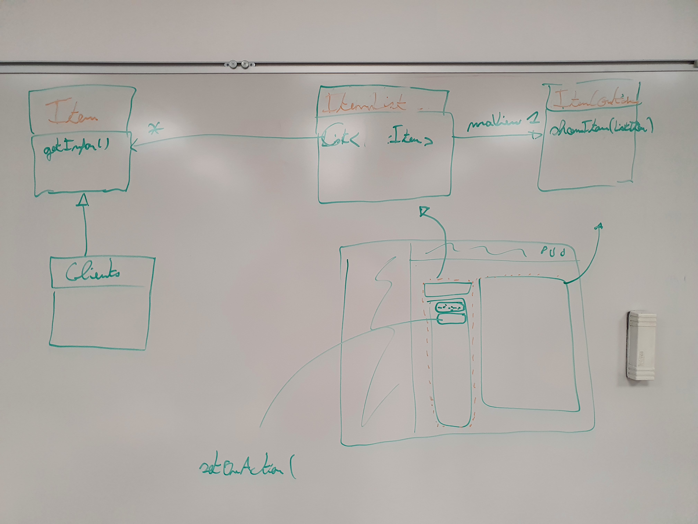

# Structure du projet

# 1 / Routage et hiérarchie JavaFX

## Élèments :


- Le **Routeur** est une classe statique (Pas d'instance, toutes les méthodes sont `static`) permettant de changer la page (ou scène actuellement affichée à l'écran).

- Un **Stage** JavaFX est tout simplement la fenêtre de l'application, soit ce qui contient les boutons réduire / plein écran / fermer et la racine de la hiérarchie (RootScene)

- La classe **RootScene** est une scène javaFX contenant
  
  - La Barre de navigation
  
  - La page courante (Scène JFX) qui est du type **IScene** (Interface)
  
  - **RootScene n'est jamais déchargée** (Il y a une unique instance dans le projet)

- Les classe de type **IScene** sont des pages de l'application, ces dernières sont chargées / déchargées par RootScene.
  
  - Une page doit est donc une classe java implémentant l'interface IScene et avec un extends sur un composant JavaFX (Le plus adapté pour la page)

  - ```java
    public class LoginScene extends VBox implements IScene
    ```
    
    - ici LoginScene contiendra ensuite ses éléments : boutons, labels, etc...

## Changer de page :

Pour changer de page, il faut changer l'instance de BaseScene actuellement affichée par RootScene.

Pour cela : 

```java
Router.goToScreen(Routes.HOME);
```

1. `Router.goToScreen(...)` -> dis à la RootScene de changer sa scène courante

2.  RootScene efface sa scène courante et affiche la nouvelle donnée par le routeur.

## Hiérarchie sous forme d'arbre :


# 2/ ItemList & ItemContainer

> Système utilisé par certaines IScene pour afficher une liste d'Item (Réservation / Clients / ...) à gauche de la page et un conteneur avec les infos de l'Item sélectionné à droite de la page.



## Ajouter une ItemList/Container à une scène
> Exemple de ClientScene.java

```java
// Création du panel à droite qui affiche les information d'un client en particulié
ClientItemContainer itemContainer = new ClientItemContainer();

// Récupération de tous les clients
List<Client> clients = Database.getInstance().getClientsDao().queryForAll();

// Création panel à gauche qui affiche la liste de clients
ItemList<Client> itemList = new ItemList<Client>(clients, itemContainer);

// On ajoute les 2 panels à la page
setLeft(itemList);
setCenter(itemContainer);

setMargin(itemList, new Insets(30));
setPadding(new Insets(30));
```
Cette implémentation va surrement changer plus tard pour plusieurs raisons :
- Très génériques (Toutes les pages vont avoir un code similaire).
- Les données sont récupérées au chargement de l'appli et non à l'ouverture de la page.

## Créer un ItemContainer

> Un itemContainer affiche donc les informations d'un Item


> Exemple : ClientItemContainer affiche les information d'un seul Client
```java
public class ClientItemContainer extends VBox implements ItemContainer<Client> {
  ...
}
```

- extends : Le type de Node a utiliser pour le container (Voir doc [JAVAFX](./JAVAFX.md))
- implements `ItemContainer<Item>`

La classe doit ensuite implémenter la méthodes `changeItem(Item)` :

> Cette méthode est appelée à chaque fois que ce container doit afficher un nouvel Item

Exemple complet pour le container de l'Item Client
```java
public class ClientItemContainer extends VBox implements ItemContainer<Client> {

    private Client client;

    public ClientItemContainer() {
        setAlignment(Pos.CENTER);
        refresh();
    }

    @Override
    public void changeItem(Client newItem) {
        client = newItem;
        refresh();
    }

    private void refresh() {
        this.getChildren().clear();

        if (client == null) {
            Label noClientLabel = new Label("Aucun client sélctionné");
            getChildren().addAll(noClientLabel);
            return;
        }

        Label name = new Label("Nom : " + client.getName());
        Label firstName = new Label("Prénom : " + client.getFirstName());

        this.getChildren().addAll(name, firstName);
    }
}
```