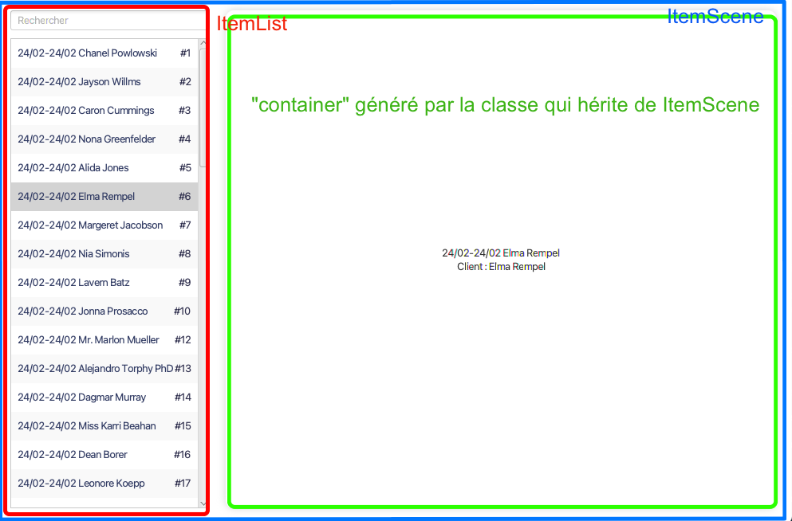

# Manuel développeur de l'application

Ce manuel regroupe les explications des systèmes composants le projet.

Les connaissances de base de JavaFX sont requises, [un document d'aide est disponible](./JAVAFX.md).

Pour installer / lancer / ... le projet, se référer au [README](./README.md).

## 1/ L'interface Item et Base de données

Le projet utilise l'ORM [ORMLite](./ORMLITE.md), et permet donc d'approcher les entités de la BD sous forme de classes. `src/main/java/database/model`


> Les liens ne sont pas affichés sur le schéma à cause de l'ORM

Chacune de ces classes (sauf exception) implémentent l'iterface Item leur forçant l'implémentation suivante :

```java
/**
 * 
 * @return Nom d'affichage condensé complet de l'item (Utilisé pour l'affichage
 *         à l'intérieur de
 *         l'ItemList
 */
public String getDisplayName();

/**
 * 
 * @return identifiant de l'item
 */
public int getId();

/**
 * 
 * @return Une chaîne de caractère permettant de rechercher
 *         parmis les données de l'item
 */
public String getSearchString();

/**
 * @return vrai si cette instance d'Item est correctement initialisé par
 *         l'ORM
 */
public boolean isForeignCorrect();

/**
 * @return Couleur qui définit l'état de l'item
 */
public Color getStatusColor();
```

C'est méthodes sont utilisées dans les différents systèmes qui sont expliqués plus bas.

## 2/ IScene

**IScene** est l'interface qui décrit les pages de l'application.

Elle fait office de structure générale à toutes ces pages et c'est elle qui est utilisée par le routeur (cf /3).

Exemple d'implémentation :
```java
public class MaScene extends VBox implements IScene {...}
```
> Ici MaScene pourra être intégrée au routeur

## 3/ Routage et hiérarchie JavaFX

Le **Routeur** est une classe statique (Pas d'instance, toutes les méthodes sont `static`) permettant de changer la page (ou scène actuellement affichée à l'écran).
La scène JavaFX RootScene agis comme une vitrine de laquelle le routeur viendrait changer la Iscene (la pages) actuellement affichée. Ainsi RootScene et les IScene ne sont jamais déchargées et  RootScene affiche (et masque) tour à tour les différentes IScene.


En plus de la Iscene, RootScene contient aussi la <u>barre de navigation</u> qui elle non plus n'est jamais déchargé. La seule exception est la page de connexion pour laquelle la barre de navigation est masquée.

```java
Router.goToScreen(Routes.HOME);
```

La hiérarchie JavaFX en haut de l'arbre du projet ressemble donc à l'arbre suivant :


## 4/ Système ItemScene / ItemList

### ItemScene

**ItemScene** est une sur-implémnetation abstraite et générique de IScene. Elle permet d'afficher des élèments de l'interface Item de façon <u>standardisée</u> : une liste des items à gauche de la page (ItemList) et les informations de l'item sélectionné à droite.



> Exemple complet d'ItemScene pour les réservations :
```java
public class ReservationsScene extends ItemScene<Reservation> {

    @Override
    public String getName() { // On donne le nom de la page
        return "Réservations";
    }

    @Override
    protected Region createContainer(Reservation item) { 
        // Création du panel de droite qui affiche l'item sélectionné
        var container = new VBox();
        container.setAlignment(Pos.CENTER);
        container.getChildren().addAll(new Label(item.getDisplayName()));
        container.getChildren().addAll(new Label("Client : " + item.getClient().getName()));
        return container;
    }

    @Override
    protected List<Reservation> queryAll() throws SQLException {
        return Database.getInstance().getReservationDao().queryForAll();
    }
}
```

### ItemList

Les pages standardisées présentent une liste des items concernés avec seulement des information basiques. En selectionnant un item dans la liste, le container sur la partie droite de la page affiche un container avec tous les détails de cet item. Ce container étant généré par les classes qui héritent de ItemScene, il varie d'une page à l'autre.

Les ItemList comportent égallement une barre de recherche. lors de la recherche, seuls les items correspondants sont affichés dans la liste.

## 5/ Système de breakpoint (Responsive)

Le système de **BreakPoint** permet de gérer les changements de taille de la fenêtre.

Il est impératif de s'inscire aux changements de taille de fenêtre via une classe `static` (BreakPointManager).
Pour s'inscrire (en tant que page ou au classe graphique JavaFX), il faut implémenter l'interface `BreakPointListener` puis implémenter les méthodes `onVerticalBreak` ou `onHorizontalBreak`.

Exemple :
```java
public class RootScene extends StackPane implements BreakPointListener {
    ...
    public RootScene() {
        BreakPointManager.addListener(this); // S'inscire en tant que listener
    }

    @Override
    public void onVerticalBreak(VBreakPoint oldBp, VBreakPoint newBp) {
       // Appelé dès que la fenêtre passe un des breakpoints
       ...
    }
}
```
